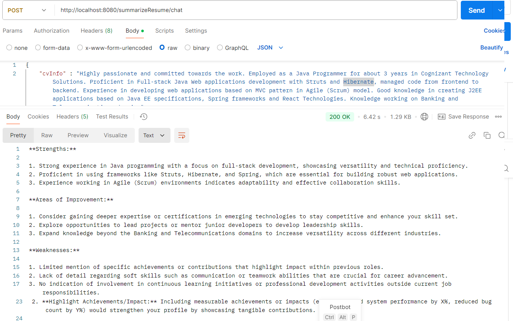

## AI DRIVEN CHATBOT APPLICATION FOR CV FEEDBACK:
* Generative AI Powered Application is the integration of Spring AI Framework with Spring Boot Application.
* Integration of Artificial Intelligence and Machine Learning into Spring-based application.
* Spring AI project aims to simplify the development of applications that incorporate artificial intelligence functionality without unnecessary complexity.
* This technique was introduced to help the developers in connecting with LLM for decision-making, solving task etc.

## OBJECTIVE:
Task is to create AI CHATBOT App for providing CV Summarized Feedback having Java Spring boot application as backend which connects with the AI technologies.
Application has to accurately interpret user input and generate precise text responses.
* Define an appropriate system instruction that aligns with the workshop objective to guide the AI model in generating concise and meaningful feedback.
* Fine-tune the chatbot by testing it with varied inputs, analysing results, and iteratively optimizing responses.
* (Optional Task): Format the output feedback to enhance readability and usability, such as categorizing feedback into sections or providing a score-based summary.

### **`Input:`** Resume Information
### **`Spring boot application:`** Customized Prompts are created and configured with System instructions & LLM parameter Settings.
### **`Output:`** Summarized feedback with Strength, Areas of Improvement and Weakness.

### STEPS implemented in Spring Boot Application:
1. Spring boot application is created with Gradle as build automation tool. Necessary dependencies are added.
2. Properties file:
    * Spring application connects with Open AI's predefined model gpt-4o.
    * Added the necessary configuration properties to connect with Open AI model (baseurl, model name, max-attempts and API key).
      API Key is added as environmental variable.
    * Configured the necessary LLM Fine Tune options to customize the model response.
3. Controller and Service classes are created. Taken necessary actions to implement the API endpoints inside these classes.
4. Adding System Information, Sending request to and Receiving response from Open AI chat model is configured inside the Spring boot application using the following techniques:
   - **`SystemPromptTemplate, Message and Prompt`**(Predefined Classes present inside org.springframework.ai.chat framework).
   - **`OpenAiChatModel class`** which has pre-built methods to connect with Open AI Model is used in Service class.
   - Interact with AI functionalities using APIs like AI Model API and Advisors API.
    1. API endpoint as Non-reactive Chatbot:
        - CV information is passed as **`JSON`** format through POST method.
        - Response is delivered to the user only when the request sent to predefined model is processed completely.
        - User and Application has to wait until the response is generated fully.
        - Response is delivered in the format: **`Strength, Weakness and Areas of Improvement`**.
    2. API endpoint as Reactive Chatbot:
        - CV information is passed as **`String`** through GET method.
        - Reactive-stack web framework, Spring WebFlux supports Reactive Streams.
        - Spring based application forwards the response/event as they happen.
        - Response is delivered as Stream, and it is more interactive.
        - User and Application no need to wait for long time until the response is processed completely.
        - Response is delivered in the format: **`Strength, Weakness and Areas of Improvement`**.

## Sample Request and Response through Postman:
